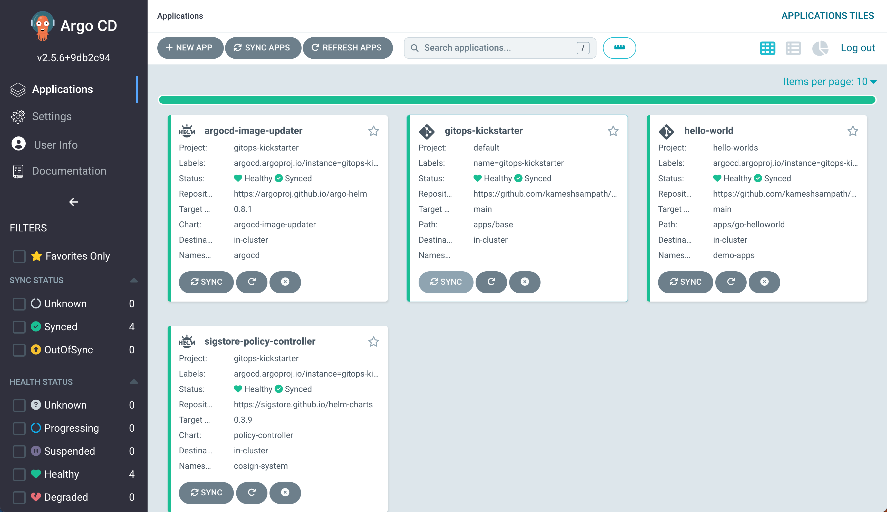

# GitOps Quickstart

A set of resources, components and scripts to get started with applying GitOps principles.

This kickstart repository resources that will setup the base infrastructure that is needed to get started with GitOps by deploying an ArgoCD base [App of Apps](https://argo-cd.readthedocs.io/en/stable/operator-manual/declarative-setup/#app-of-apps) which deploys,

- [ArgoCD](https://argo-cd.readthedocs.io/) [Image Updater](https://argocd-image-updater.readthedocs.io/en/stable/)
- [Sigstore](https://sigstore.dev) [Policy Controller](https://github.com/sigstore/policy-controller)

## Pre-requisites

- [Google Cloud Account](https://cloud.google.com)
- [terraform](https://terraform.build)
- [helm](https://helm.sh)
- [kustomize](https://kustomize.io)
- [direnv](https://direnv.net) **Optional**

## Download Sources

Clone the sources and `cd` into it,

```shell
git clone https://github.com/kameshsampath/gitops-quickstart.git && cd "$(basename "$_" .git)"
export GITOPS_TUTORIAL_HOME="$PWD"
```

## Kubernetes Cluster

Running the following command which will setup a GKE cluster using terraform,

```shell
make create
```

> **NOTE**: The terraform will take approx ~5-10mins or even more based on your bandwidth.

### ArgoCD Deployment Details

#### Admin Password

```shell
terraform output -raw argocd_admin_password
```

#### ArgoCD Application URL

```shell
terraform output -raw argocd_service_url
```

### Create App of Apps

Run the following command to create the ArgoCD app that house base components required to deploy other applications,

```shell
kubectl apply -f app.yaml
```

## Building  `hello-world` application

```shell
cd "$GITOPS_TUTORIAL_HOME/work"
wget https://github.com/kameshsampath/go-hello-world/archive/refs/heads/main.zip
cd "$GITOPS_TUTORIAL_HOME/work/go-hello-world-main"
export TUTORIAL_HOME="$PWD"
```

Download [ko](https://ko.build/install/) and add to your `.$PATH`.

Set `$KO_DOCKER_REPO`,

```shell
# e.g. KO_DOCKER_REPO=docker.io/kameshsampath/go-hello-world
export KO_DOCKER_REPO=<your container image registry repo>
```

Run the following command to build and push the hello world image to `$KO_DOCKER_REPO`,

```shell
ko build --bare --platform=linux/amd64 --platform=linux/arm64 "$TUTORIAL_HOME"
```

## Deploy `hello-world` application

Edit and update `$GITOPS_TUTORIAL_HOME/helm_vars/app-of-apps/values.yaml` and append the following helm values, allowing to deploy the `hello-world` application using ArgoCD,

```yaml
# the hello world demo application
helloWorld:
  # flag to deploy hello world
  deploy: true
  image:
    repo: $KO_DOCKER_REPO
```

Commit and push the values file to your fork of GitOps repo, to trigger the deployment of the `hello-world` application.

If all went well you ArgoCD dashboard should look like.



Make changes to `$TUTORIAL_HOME/server.go`, build and push a new image to see ArgoCD synching your deployments to latest image digest.

## Clean up

```shell
make destroy
```

## Troubleshooting

- [Cosigned Helm Chart - tls: no certificates configured](https://github.com/sigstore/policy-controller/issues/369)

```shell
kubectl delete leases.coordination.k8s.io -n cosign-system --all
```
